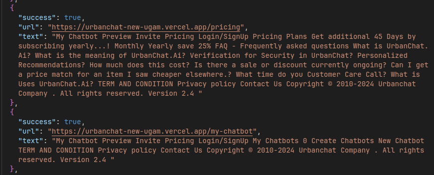

# Website Crawler

## Introduction

This Node.js and TypeScript application is designed to crawl a website recursively, extracting text content from each page and gathering all the links within the website.

## Installation

1. Clone this repository to your local machine:

   ```bash
   git clone https://github.com/<yourusername>/crawler.git
   ```

2. Navigate into the project directory:

   ```bash
   cd crawler
   ```

3. Install dependencies using npm:

   ```bash
   npm install
   ```

## Configuration

Before running the crawler, you may need to configure the crawling parameters in the `config.ts` file. You can set the starting URL, maximum depth of crawling, and any other necessary settings there.

## Usage

To start the crawler, run the following command:

```bash
npm run dev
```

The crawler will begin crawling the specified website, extracting text content from each page and collecting all the links. You'll see progress logs in the console as the crawler progresses through the site.

## Output

Once the crawling process is complete, the crawler will generate output files containing the crawled text content and a list of all the links found within the website. These files will be saved in the output directory.




## Contributions
Contributions to this project are welcome! If you encounter any issues or have suggestions for improvements, please feel free to open an issue or submit a pull request.
